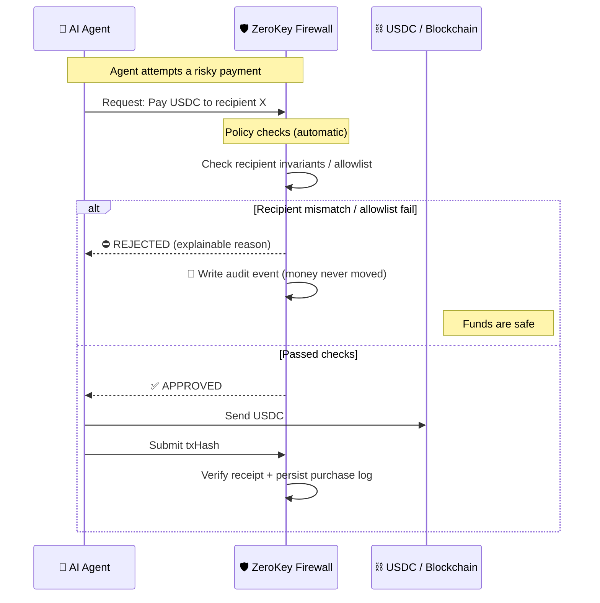

# ZeroKey Treasury

> **Firewall for Agent Commerce** — policy decides **before money moves**.

[](https://ethglobal.com)
[](https://ens.domains)
[](https://arc.network)
[](https://base.org)

### The bigger shift (Internet → Agents)

- **Internet era:** moved information online.
- **Agent era:** moves decisions and execution off humans.

So we need a new standard layer that enforces policy **before money moves**.

### The premise we break (Before / After)

**Before:** In DeFi, if you sign, money moves. There is no second chance.

**After:** With ZeroKey, signing is a request. Money moves only if policy says yes.

### Mental model

AI agents are overconfident interns. **ZeroKey is the CFO standing between your agent and your wallet.**

ZeroKey Treasury is an **execution firewall** for agent-to-agent commerce: agents discover providers, negotiate, run a policy check (recipient invariants, spend limits, anomaly checks), then pay in USDC using an HTTP 402 flow.

All outcomes are auditable:

- **APPROVED** → we verify the USDC transfer by on-chain receipt (txHash) and persist a Purchase Log
- **REJECTED** → we write a Blocked Audit Log event (“money never moved”)

Bonus (read-only): we also show **ERC-8004 Identity Registry** signals on Base Sepolia as an on-chain trust signal source (not claiming full compliance).

## 🎬 Demo

**Live Demo**: [https://zerokey.exe.xyz:8000](https://zerokey.exe.xyz:8000)

Quick links:

- Demo script: `docs/DEMO_SCRIPT.md`
- Demo checklist: `docs/DEMO_CHECKLIST.md`
- API Docs (Swagger): `/docs`
- A2A Payment Router spec: `docs/spec/AGENT_PAYMENT_ROUTER.md`
- Sponsor tech map: `docs/SPONSOR_TECH_MAP.md`
- Trust score model: `docs/TRUST_SCORE_MODEL.md`

### Firewall before execution (30-second mental model)



```
[AI Assistant] "Translate this contract to English"
        │
        ▼ A2A Discovery & Negotiation
[Provider A] "$0.05/1000 tokens" - Trust: 85/100
[Provider B] "$0.03/1000 tokens" - Trust: 78/100
[Provider C] "$0.01/1000 tokens" - Trust: 15/100 ← Suspicious
        │
        ▼ Negotiation Result: Provider B selected ($0.03)
        │
        ▼ ZeroKey Firewall
    ┌────────────────────────────────────────┐
    │ LLM Analysis:                          │
    │ • Purpose: Business translation ✅     │
    │ • Amount: $0.03 (within budget) ✅     │
    │ • Provider: Trust score 78/100 ✅      │
    │ • Risk: LOW                            │
    │ → APPROVED                             │
    └────────────────────────────────────────┘
        │
        ▼ x402 Payment
    HTTP 402 → USDC Transfer → API Response
```

---

## 🏆 Prize Tracks

### ENS Integration ($3,500 - $5,000)

ZeroKey Treasury uses **ENS (Ethereum Name Service)** for decentralized AI agent identity:

- **Provider ENS Profiles**: AI service providers can register using ENS names
- **Custom Text Records**: We leverage ENS text records for AI agent discovery:
  - `ai.api.endpoint` - API endpoint URL
  - `ai.services` - Comma-separated service types
  - `ai.trustscore` - Reputation score (0-100)
- **Address Resolution**: Seamless ENS name → address resolution for payments
- **Reverse Lookup**: Display ENS names instead of raw addresses

**Example**: `translateai.eth` can register their translation service on-chain via ENS records.

### Arc Network - Global Treasury ($2,500)

ZeroKey Treasury is designed as a **global payout and treasury system** using USDC:

- **Multi-chain Support**: Works on Base Sepolia, ready for Arc Network deployment
- **USDC Payments**: Native stablecoin payments via Circle integration
- **AI Treasury Management**: AI agents can autonomously manage budgets and payments
- **Global Accessibility**: Any AI agent worldwide can discover and pay for services

---

## 🎯 Key Features

| Feature                | Description                                             |
| ---------------------- | ------------------------------------------------------- |
| **A2A Gateway**        | AI agents discover and negotiate with service providers |
| **Execution Firewall** | LLM-powered semantic analysis + policy enforcement      |
| **x402 Payment**       | HTTP 402 protocol for USDC micropayments                |
| **On-chain Guard**     | Approval decisions recorded on blockchain               |
| **ENS Integration**    | Decentralized identity for AI agents                    |
| **Trust Scoring**      | Explainable trust score (payment predictability)        |
| **Fail-safe**          | Blocks transactions when analysis fails                 |

**Trust score design**: see `docs/TRUST_SCORE_MODEL.md` (verifiable signals, explainable features, not social ratings).

---

## 🚀 Quick Start

```bash
# Clone and install
git clone https://github.com/yourusername/HackMoney2026.git
cd HackMoney2026
pnpm install

# Start backend (port 3001)
cd packages/backend && pnpm dev &

# Start frontend (port 8000)
cd packages/frontend && PORT=8000 pnpm dev
```

**URLs**:

- Frontend: http://localhost:8000
- Backend API: http://localhost:3001
- Health Check: http://localhost:3001/health

---

## 🏗️ Architecture

```
┌─────────────────────────────────────────────────────────────────────────────┐
│                           Frontend (Next.js 15)                             │
│  ┌──────────────┐  ┌──────────────┐  ┌──────────────┐  ┌──────────────┐    │
│  │  Dashboard   │  │  Marketplace │  │  Negotiation │  │   History    │    │
│  │  (Overview)  │  │  (Providers) │  │  (A2A Chat)  │  │  (Purchases) │    │
│  └──────────────┘  └──────────────┘  └──────────────┘  └──────────────┘    │
└─────────────────────────────────────┬──────────────────────────────────────┘
                                      │
                         REST API + WebSocket
                                      │
┌─────────────────────────────────────┼──────────────────────────────────────┐
│                           Backend (Hono)                                    │
│  ┌───────────────────┐   ┌───────────────────┐   ┌───────────────────┐     │
│  │ A2A Gateway       │   │ Firewall Engine   │   │ x402 Handler      │     │
│  │ - Discovery       │   │ - LLM Analyzer    │   │ - Payment Req     │     │
│  │ - Negotiation     │   │ - Policy Check    │   │ - Verify Proof    │     │
│  │ - ENS Resolution  │   │ - Trust Scoring   │   │ - USDC Transfer   │     │
│  └─────────┬─────────┘   └─────────┬─────────┘   └─────────┬─────────┘     │
└────────────┼───────────────────────┼─────────────────────────┼─────────────┘
             │                       │                         │
             ▼                       ▼                         ▼
┌───────────────────┐   ┌───────────────────┐   ┌───────────────────────────┐
│ Provider Registry │   │ SQLite DB         │   │ Blockchain (Base Sepolia) │
│ (ENS-enabled)     │   │ (Audit Trail)     │   │ - ZeroKeyGuard.sol        │
└───────────────────┘   └───────────────────┘   │ - USDC Payments           │
                                                └───────────────────────────┘
```

---

## 📡 API Reference

### Discovery

```bash
# Find translation providers
GET /api/a2a/discover?service=translation

# Response includes wallet addresses for ENS lookup
{
  "results": [
    {
      "id": "translate-ai-001",
      "name": "TranslateAI Pro",
      "trustScore": 85,
      "price": "0.03",
      "walletAddress": "0xd8dA6BF26964aF9D7eEd9e03E53415D37aA96045"
    }
  ]
}
```

### Negotiation

```bash
# Start negotiation session
POST /api/a2a/negotiate
{
  "clientId": "0x...",
  "providerId": "translate-ai-001",
  "service": "translation",
  "initialOffer": "0.025"
}

# Accept offer
POST /api/a2a/negotiate/:sessionId/offer
{
  "amount": "0.03",
  "type": "accept"
}
```

### Firewall Check

```bash
# Request approval before payment
POST /api/firewall/check
{
  "sessionId": "neg-xxx",
  "userAddress": "0x..."
}

# Response
{
  "approved": true,
  "firewall": {
    "decision": "APPROVED",
    "riskLevel": 1,
    "reasons": ["High-trust provider"]
  },
  "analysis": {
    "classification": "translation",
    "reason": "Low-risk translation service request..."
  }
}
```

---

## 🛡️ Firewall Decisions

| Scenario                     | Decision | Reason                    |
| ---------------------------- | -------- | ------------------------- |
| Trusted provider (85+ score) | APPROVED | High trust, within budget |
| Moderate provider (40-84)    | WARNING  | Proceed with caution      |
| Low trust provider (<40)     | REJECTED | Potential scam risk       |
| Budget exceeded              | REJECTED | Daily limit reached       |
| Rate limit hit               | REJECTED | Too many requests         |
| Analysis failed              | REJECTED | Fail-safe default         |

---

## 🛠️ Tech Stack

| Layer               | Technology                        |
| ------------------- | --------------------------------- |
| **Smart Contracts** | Solidity 0.8.24, Foundry          |
| **Backend**         | Hono, TypeScript, Zod             |
| **Frontend**        | Next.js 15, React 19, TailwindCSS |
| **Web3**            | Wagmi, Viem, RainbowKit           |
| **AI**              | Claude (Anthropic)                |
| **Payments**        | USDC, x402 Protocol               |
| **Identity**        | ENS (Ethereum Name Service)       |
| **Database**        | SQLite + Drizzle ORM              |
| **Blockchain**      | Base Sepolia (Arc-ready)          |

---

## 📁 Project Structure

```
zerokey-treasury/
├── packages/
│   ├── contracts/          # Solidity smart contracts
│   │   └── src/
│   │       ├── ZeroKeyGuard.sol
│   │       └── interfaces/
│   │
│   ├── backend/            # API server (Hono)
│   │   └── src/
│   │       ├── routes/
│   │       │   ├── a2a.ts         # A2A Gateway
│   │       │   ├── firewall.ts    # Execution firewall
│   │       │   └── pay.ts         # x402 payments
│   │       ├── services/
│   │       │   ├── analyzer.ts    # LLM analysis
│   │       │   └── firewall.ts    # Policy engine
│   │       └── db/
│   │           └── schema.ts      # SQLite schema
│   │
│   ├── frontend/           # Dashboard UI
│   │   └── src/
│   │       ├── app/
│   │       │   ├── page.tsx           # Home
│   │       │   ├── marketplace/       # Provider discovery
│   │       │   ├── negotiate/         # A2A negotiation
│   │       │   └── dashboard/         # User dashboard
│   │       ├── components/
│   │       │   └── EnsProfile.tsx     # ENS integration
│   │       └── lib/
│   │           └── ens.ts             # ENS utilities
│   │
│   └── shared/             # Shared types
│       └── src/
│           ├── types.ts
│           └── constants.ts   # Chain configs (incl. Arc)
│
└── docs/
    ├── AGENTS.md           # AI agent context
    ├── CLAUDE.md           # Development guide
    └── prize/PRIZE.md      # Prize track info
```

---

## 🔐 Security

- **Fail-safe Design**: Default to REJECT when LLM analysis fails
- **Rate Limiting**: Prevents abuse (10 requests/minute)
- **Budget Control**: Daily spending limits per user
- **Trust Scoring**: Reputation-based provider filtering
- **Audit Trail**: All decisions logged to SQLite + blockchain
- **Signed Requests**: HTTP signature verification for critical endpoints

---

## 📄 License

MIT License - see [LICENSE](LICENSE)

---

## 🙏 Acknowledgments

Built for **HackMoney 2026** by ETHGlobal

- [ENS](https://ens.domains) - Decentralized naming
- [Arc Network](https://arc.network) - Circle's L1 for USDC
- [Base](https://base.org) - Ethereum L2
- [Anthropic](https://anthropic.com) - Claude AI
- [Circle](https://circle.com) - USDC

---

## 📞 Contact

- GitHub: [@susumutomita](https://github.com/susumutomita)
- Twitter: [@tomitasusumu999](https://twitter.com/tomitasusumu999)

---

**ZeroKey Treasury** - _Execution Governance for Autonomous Finance_
