# ZeroKey Treasury

> **Firewall for Agent Commerce** — policy decides **before money moves**.

[](https://ethglobal.com)
[](https://ens.domains)
[](https://arc.network)
[](https://base.org)

### The bigger shift (Internet → Agents)

- **Internet era:** moved information online.
- **Agent era:** moves decisions and execution off humans.

So we need a new standard layer that enforces policy **before money moves**.

### The premise we break (Before / After)

**Before:** In DeFi, if you sign, money moves. There is no second chance.

**After:** With ZeroKey, signing is a request. Money moves only if policy says yes.

### Mental model

AI agents are overconfident interns. **ZeroKey is the CFO standing between your agent and your wallet.**

ZeroKey Treasury is an **execution firewall** for agent-to-agent commerce: agents discover providers, negotiate, run a policy check (recipient invariants, spend limits, anomaly checks), then pay in USDC using an HTTP 402 flow.

All outcomes are auditable:

- **APPROVED** → we verify the USDC transfer by on-chain receipt (txHash) and persist a Purchase Log
- **REJECTED** → we write a Blocked Audit Log event (“money never moved”)

Bonus (read-only): we also show **ERC-8004 Identity Registry** signals on Base Sepolia as an on-chain trust signal source (not claiming full compliance).

## 🎬 Demo

**Live Demo**: [https://zerokey.exe.xyz:8000](https://zerokey.exe.xyz:8000)

Quick links:

- Demo script: `docs/DEMO_SCRIPT.md`
- Demo checklist: `docs/DEMO_CHECKLIST.md`
- API Docs (Swagger): `/docs`
- **Safe Guard Setup**: `/setup` - Protect your Safe multisig
- A2A Payment Router spec: `docs/spec/AGENT_PAYMENT_ROUTER.md`
- Sponsor tech map: `docs/SPONSOR_TECH_MAP.md`
- Trust score model: `docs/TRUST_SCORE_MODEL.md`

### Safe Guard Protection (NEW)

Protect your Safe multisig wallet with ZeroKey Guard:

1. Go to `/setup` and enter your Safe address
2. Configure policy (max transaction amount, daily limits)
3. Sign the `setGuard()` transaction in Safe App
4. All future transactions from this Safe go through ZeroKey policy checks

```
Safe Transaction → ZeroKey Guard → Policy Check → Execute or Block
```

### Firewall before execution (30-second mental model)

```mermaid
sequenceDiagram
    participant Agent as 🤖 AI Agent
    participant Firewall as ğŸ›¡ï¸ ZeroKey Firewall
    participant Chain as â›“ï¸ USDC / Blockchain

    Note over Agent,Firewall: Agent attempts a risky payment
    Agent->>Firewall: Request: Pay USDC to recipient X

    Note over Firewall: Policy checks (automatic)
    Firewall->>Firewall: Check recipient invariants / allowlist

    alt Recipient mismatch / allowlist fail
        Firewall-->>Agent: â›” REJECTED (explainable reason)
        Firewall->>Firewall: 📠Write audit event (money never moved)
        Note right of Chain: Funds are safe
    else Passed checks
        Firewall-->>Agent: ✅ APPROVED
        Agent->>Chain: Send USDC
        Agent->>Firewall: Submit txHash
        Firewall->>Firewall: Verify receipt + persist purchase log
    end
```



## Agent integration (API-first)

The UI is just a demo shell. In production, **an agent uses ZeroKey by calling the API**.

Minimal flow:

1. `POST /api/a2a/negotiate` (create session)
2. `POST /api/a2a/negotiate/:sessionId/offer` (reach agreement)
3. `POST /api/firewall/check` (execution gate)
4. If approved: `POST /api/pay/request` → (HTTP 402) → send USDC → `POST /api/pay/submit` with `txHash`

## MCP Integration (Agent Onboarding)

Connect any MCP-compatible AI agent (Claude Desktop, OpenClaw, etc.) to ZeroKey in 3 steps:

### 1. Generate an API Key

```bash
# Via API
curl -X POST https://zerokey.exe.xyz:8000/api/agents \
  -H "Content-Type: application/json" \
  -d '{"name":"my-agent","safeAddress":"0xYourSafe..."}'
# → { "apiKey": "zk_abc123...", "agent": { ... } }

# Or via UI: /setup → Step 4 "Connect Agent" → API Keys tab
```

### 2. Configure MCP Client

Add to `claude_desktop_config.json` (or any MCP client):

```json
{
  "mcpServers": {
    "zerokey": {
      "command": "npx",
      "args": ["-y", "@zerokey/mcp-server@latest"],
      "env": {
        "ZEROKEY_API_URL": "https://zerokey.exe.xyz:8000",
        "ZEROKEY_API_KEY": "zk_your_key_here"
      }
    }
  }
}
```

### 3. Use the Tools

| Tool               | Description                                    |
| ------------------ | ---------------------------------------------- |
| `zerokey_discover` | Search marketplace for API services by keyword |
| `zerokey_pay`      | Pay a provider through the execution firewall  |
| `zerokey_balance`  | Check agent budget and spending status         |
| `zerokey_history`  | View purchase audit trail                      |

**Example conversation:**

```
User: "Translate this contract to English"
Agent: → zerokey_discover(service: "translation")
     → zerokey_pay(providerId: "translate-ai-001", amount: "0.03", task: "Translate contract")
     → Returns translation result (or REJECTED with reason)
```

Every payment goes through the ZeroKey firewall: spending limits, trust score checks, category restrictions, and rate limiting — all enforced **before money moves**.

---

## Cost model (why routing is worth it)

Routing adds a small governance/audit overhead (like fraud detection / 3DS), but prevents catastrophic loss:

- **Cost:** tiny % fee or subscription (future pricing)
- **Benefit:** prevents recipient swap / malicious provider / overcharge **before** money moves, with audit-grade proof

```
[AI Assistant] "Translate this contract to English"
        │
        ▼ A2A Discovery & Negotiation
[Provider A] "$0.05/1000 tokens" - Trust: 85/100
[Provider B] "$0.03/1000 tokens" - Trust: 78/100
[Provider C] "$0.01/1000 tokens" - Trust: 15/100 ← Suspicious
        │
        ▼ Negotiation Result: Provider B selected ($0.03)
        │
        ▼ ZeroKey Firewall
    ┌────────────────────────────────────────┐
    │ LLM Analysis:                          │
    │ • Purpose: Business translation ✅     │
    │ • Amount: $0.03 (within budget) ✅     │
    │ • Provider: Trust score 78/100 ✅      │
    │ • Risk: LOW                            │
    │ → APPROVED                             │
    └────────────────────────────────────────┘
        │
        ▼ x402 Payment
    HTTP 402 → USDC Transfer → API Response
```

---

## 🏆 Prize Tracks — Code Map & Verified Endpoints

> For judges: every endpoint below was **verified running** on `localhost:3001`.
> Full file-level map: [`docs/SPONSOR_TECH_MAP.md`](docs/SPONSOR_TECH_MAP.md)

### Why ZeroKey needs crosschain USDC via Arc

AI agents will pay for services across any chain — translation on Ethereum, image generation on Base, data on Arbitrum. Without chain abstraction, each agent needs wallets and USDC on every chain. **Arc as Liquidity Hub** solves this: one deposit, pay anywhere.

ZeroKey adds a critical missing layer: **policy enforcement before money moves**. Without a firewall, an agent can drain a treasury in seconds. With ZeroKey + Arc, agents get global reach _and_ safety.

### Architecture: where each prize fits

```
┌──────────────────────────────────────────────────────────────────────────┐
│                         AI Agent (autonomous)                            │
│  "Translate this contract" → discover provider → negotiate price        │
└───────────────────────────────────┬──────────────────────────────────────┘
                                    │
                    ┌───────────────▼────────────────┐
                    │  A2A Gateway (discovery/negotiate)│ ← ENS Prize
                    │  ENS text records for identity   │   (ai.api.endpoint,
                    │  Trust scoring via ENS name      │    ai.services,
                    └───────────────┬────────────────┘    ai.trustscore)
                                    │
                    ┌───────────────▼────────────────┐
                    │  ZeroKey Firewall               │ ← Arc Track 3
                    │  • Recipient invariant check    │   (Agentic Commerce)
                    │  • Spend limits & daily caps    │
                    │  • LLM semantic risk analysis   │
                    │  Decision: APPROVED / REJECTED  │
                    └───────────┬────────┬───────────┘
                     APPROVED  │        │ REJECTED
                    ┌──────────▼──┐  ┌──▼─────────────┐
                    │ Circle      │  │ Blocked Audit   │
                    │ Gateway     │  │ Log (money      │
                    │ via Arc Hub │  │ never moved)    │
                    └──────┬──────┘  └─────────────────┘
                           │
              ┌────────────▼─────────────┐
              │ Arc Liquidity Hub        │ ← Arc Track 1
              │ (domain 26)              │   (Chain Abstracted)
              │                          │
              │  Source → Arc → Dest     │ ← Arc Track 2
              │  Multi-payout support   │   (Treasury/Payouts)
              └──────────┬───────────────┘
                         │
              ┌──────────▼───────────────┐
              │ Safe Guard (on-chain)    │ ← Safe Prize
              │ checkTransaction() hook  │
              │ Pre-approval required    │
              └──────────────────────────┘
```

### Design: how each piece integrates

1. **Circle Gateway** is not a wrapper — we call the real Gateway API (`gateway-api-testnet.circle.com`) for balance queries, transfer requests, and `/v1/info`. No mocks or demo fallbacks exist. Real EIP-712 BurnIntent signing against Circle's `evm-gateway-contracts` specification.
2. **Firewall runs before every payment**, not after. The `/transfer`, `/payout`, and `/agent-commerce` endpoints all call `checkFirewall()` first.
3. **Arc routing is automatic**: if source and destination are both non-Arc domains, the service routes through Arc (domain 26) as hub. The response includes `arcRouting.routePath` showing the actual path.
4. **ENS is used for agent discovery**, not just display. Custom text records (`ai.api.endpoint`, `ai.services`, `ai.trustscore`) make providers discoverable on-chain.

---

### Arc Track 1: Chain Abstracted USDC ($5,000)

**Why**: Agents need to pay across chains without managing multiple wallets. Arc as Liquidity Hub unifies USDC.

| File                                                   | Purpose                                                 |
| ------------------------------------------------------ | ------------------------------------------------------- |
| `packages/backend/src/services/gateway.ts`             | `transferViaGateway()` — Source → Arc Hub → Destination |
| `packages/backend/src/routes/gateway.ts`               | `POST /transfer` with firewall gate                     |
| `packages/frontend/src/components/CrosschainPanel.tsx` | Transfer UI with Arc routing visualization              |
| `packages/shared/src/constants.ts`                     | `GATEWAY_CONFIG`, Arc domain 26, USDC addresses         |

**Verified behavior** (real Gateway API response — no mocks):

```bash
POST /api/gateway/transfer
{
  "sourceDomain": 6,
  "destinationDomain": 26,
  "sender": "0x7aD8317e9aB4837AEF734e23d1C62F4938a6D950",
  "recipient": "0xae0D06961f7103B43ed93721d5a2644c09EB159C",
  "amountUsdc": "1.00"
}
# Response (honest — we have no testnet USDC deposited):
{
  "success": false,
  "error": "Gateway API error (400): Insufficient balance for depositor 0x7ad8...: available 0, required 1.01005"
}
# This proves: BurnIntent was signed correctly (EIP-712), Gateway validated the
# signature, then checked real on-chain balances. The full pipeline is working.
```

---

### Arc Track 2: Global Payouts & Treasury ($2,500)

**Why**: Treasury teams need to pay contractors across chains in one batch. Arc Hub eliminates per-chain bridging.

| File                                                   | Purpose                                          |
| ------------------------------------------------------ | ------------------------------------------------ |
| `packages/backend/src/services/gateway.ts`             | `executeMultiPayout()` — batch payouts via Arc   |
| `packages/backend/src/routes/gateway.ts`               | `POST /payout` (1-16 recipients, firewall-gated) |
| `packages/frontend/src/components/CrosschainPanel.tsx` | Multi-Payout tab with recipient builder          |

**How it works**: Each recipient in the batch gets an individual `transferViaGateway()` call with real BurnIntent signing. Firewall checks all recipients before any transfers execute.

---

### Arc Track 3: Agentic Commerce ($2,500)

**Why**: AI agents need to purchase services autonomously. Without a firewall, one compromised agent drains the treasury.

| File                                        | Purpose                                            |
| ------------------------------------------- | -------------------------------------------------- |
| `packages/backend/src/routes/gateway.ts`    | `POST /agent-commerce` — agent purchase + firewall |
| `packages/backend/src/services/firewall.ts` | `checkFirewall()` — policy engine                  |
| `packages/backend/src/services/analyzer.ts` | Claude API risk analysis                           |
| `packages/backend/src/routes/a2a.ts`        | Agent discovery & negotiation                      |

**How it works**: Agent requests a purchase → firewall checks policy → if approved, signs a real BurnIntent and submits to Gateway API. Same real pipeline as Track 1.

---

### ENS Integration ($3,500 + $1,500)

**Why**: AI agents need discoverable, verifiable identities. ENS text records make agent capabilities queryable on-chain.

| File                                              | Purpose                                                       |
| ------------------------------------------------- | ------------------------------------------------------------- |
| `packages/frontend/src/lib/ens.ts`                | Forward/reverse resolution, custom text records, batch lookup |
| `packages/frontend/src/components/EnsProfile.tsx` | Profile card with avatar, social links, AI fields             |
| `packages/backend/src/services/ens.ts`            | Server-side ENS resolution                                    |
| `packages/backend/src/services/trustScore.ts`     | ENS name as trust signal                                      |

**Custom text records for AI agent discovery**:

| Record Key        | Purpose            | Example                          |
| ----------------- | ------------------ | -------------------------------- |
| `ai.api.endpoint` | API URL            | `https://api.translateai.eth/v1` |
| `ai.services`     | Service types      | `translation,summarization`      |
| `ai.trustscore`   | Reputation (0-100) | `85`                             |

---

### Safe Guard ($2,500)

**Why**: Multisig wallets need policy enforcement at the contract level. Safe Guard blocks unapproved transactions before execution.

| File                                               | Purpose                                              |
| -------------------------------------------------- | ---------------------------------------------------- |
| `packages/contracts/src/SafeZeroKeyGuard.sol`      | `checkTransaction()` hook, per-Safe policy           |
| `packages/backend/src/services/safeGuardOracle.ts` | Oracle: monitor, evaluate, submit decisions          |
| `packages/backend/src/routes/guard.ts`             | `POST /register`, `GET /status`, `POST /pre-approve` |
| `packages/frontend/src/app/setup/page.tsx`         | Setup wizard UI                                      |

**Deployed**: `0x5fBdEEE03e76Bb0616060697D0d41300F3B2d3D2` on Base Sepolia

---

### Prize Summary

| Prize                         | Amount      | Status                    | Key Endpoint / File                |
| ----------------------------- | ----------- | ------------------------- | ---------------------------------- |
| Arc Track 1: Chain Abstracted | $5,000      | Real API (needs deposit)  | `POST /api/gateway/transfer`       |
| Arc Track 2: Treasury/Payouts | $2,500      | Real API (needs deposit)  | `POST /api/gateway/payout`         |
| Arc Track 3: Agentic Commerce | $2,500      | Real API (needs deposit)  | `POST /api/gateway/agent-commerce` |
| ENS Integration               | $3,500 pool | Real (mainnet resolution) | `lib/ens.ts`, `EnsProfile.tsx`     |
| ENS Creative DeFi             | $1,500      | Implemented               | AI agent text records              |
| Safe Guard                    | $2,500      | Deployed on Base Sepolia  | `SafeZeroKeyGuard.sol`             |

> **"Real API (needs deposit)"** means: EIP-712 BurnIntent signing is correct, Gateway API validates the signature and checks real balances. Transfers will succeed once USDC is deposited to the GatewayWallet contract.

---

## 🎯 Key Features

| Feature                | Description                                             |
| ---------------------- | ------------------------------------------------------- |
| **A2A Gateway**        | AI agents discover and negotiate with service providers |
| **Execution Firewall** | LLM-powered semantic analysis + policy enforcement      |
| **x402 Payment**       | HTTP 402 protocol for USDC micropayments                |
| **On-chain Guard**     | Approval decisions recorded on blockchain               |
| **ENS Integration**    | Decentralized identity for AI agents                    |
| **Trust Scoring**      | Explainable trust score (payment predictability)        |
| **Fail-safe**          | Blocks transactions when analysis fails                 |

**Trust score design**: see `docs/TRUST_SCORE_MODEL.md` (verifiable signals, explainable features, not social ratings).

---

## 🚀 Quick Start

```bash
# Clone and install
git clone https://github.com/yourusername/HackMoney2026.git
cd HackMoney2026
pnpm install

# Start backend (port 3001)
cd packages/backend && pnpm dev &

# Start frontend (port 8000)
cd packages/frontend && PORT=8000 pnpm dev
```

**URLs**:

- Frontend: http://localhost:8000
- Backend API: http://localhost:3001
- Health Check: http://localhost:3001/health

---

## 🏗️ Architecture

```
┌─────────────────────────────────────────────────────────────────────────────┐
│                           Frontend (Next.js 15)                             │
│  ┌──────────────┐  ┌──────────────┐  ┌──────────────┐  ┌──────────────┐    │
│  │  Dashboard   │  │  Marketplace │  │  Negotiation │  │   History    │    │
│  │  (Overview)  │  │  (Providers) │  │  (A2A Chat)  │  │  (Purchases) │    │
│  └──────────────┘  └──────────────┘  └──────────────┘  └──────────────┘    │
└─────────────────────────────────────┬──────────────────────────────────────┘
                                      │
                         REST API + WebSocket
                                      │
┌─────────────────────────────────────┼──────────────────────────────────────┐
│                           Backend (Hono)                                    │
│  ┌───────────────────┐   ┌───────────────────┐   ┌───────────────────┐     │
│  │ A2A Gateway       │   │ Firewall Engine   │   │ x402 Handler      │     │
│  │ - Discovery       │   │ - LLM Analyzer    │   │ - Payment Req     │     │
│  │ - Negotiation     │   │ - Policy Check    │   │ - Verify Proof    │     │
│  │ - ENS Resolution  │   │ - Trust Scoring   │   │ - USDC Transfer   │     │
│  └─────────┬─────────┘   └─────────┬─────────┘   └─────────┬─────────┘     │
└────────────┼───────────────────────┼─────────────────────────┼─────────────┘
             │                       │                         │
             ▼                       ▼                         ▼
┌───────────────────┐   ┌───────────────────┐   ┌───────────────────────────┐
│ Provider Registry │   │ SQLite DB         │   │ Blockchain (Base Sepolia) │
│ (ENS-enabled)     │   │ (Audit Trail)     │   │ - ZeroKeyGuard.sol        │
└───────────────────┘   └───────────────────┘   │ - USDC Payments           │
                                                └───────────────────────────┘
```

---

## 📡 API Reference

### Discovery

```bash
# Find translation providers
GET /api/a2a/discover?service=translation

# Response includes wallet addresses for ENS lookup
{
  "results": [
    {
      "id": "translate-ai-001",
      "name": "TranslateAI Pro",
      "trustScore": 85,
      "price": "0.03",
      "walletAddress": "0xae0D06961f7103B43ed93721d5a2644c09EB159C"
    }
  ]
}
```

### Negotiation

```bash
# Start negotiation session
POST /api/a2a/negotiate
{
  "clientId": "0x...",
  "providerId": "translate-ai-001",
  "service": "translation",
  "initialOffer": "0.025"
}

# Accept offer
POST /api/a2a/negotiate/:sessionId/offer
{
  "amount": "0.03",
  "type": "accept"
}
```

### Firewall Check

```bash
# Request approval before payment
POST /api/firewall/check
{
  "sessionId": "neg-xxx",
  "userAddress": "0x..."
}

# Response
{
  "approved": true,
  "firewall": {
    "decision": "APPROVED",
    "riskLevel": 1,
    "reasons": ["High-trust provider"]
  },
  "analysis": {
    "classification": "translation",
    "reason": "Low-risk translation service request..."
  }
}
```

---

## 🛡️ Firewall Decisions

| Scenario                     | Decision | Reason                    |
| ---------------------------- | -------- | ------------------------- |
| Trusted provider (85+ score) | APPROVED | High trust, within budget |
| Moderate provider (40-84)    | WARNING  | Proceed with caution      |
| Low trust provider (<40)     | REJECTED | Potential scam risk       |
| Budget exceeded              | REJECTED | Daily limit reached       |
| Rate limit hit               | REJECTED | Too many requests         |
| Analysis failed              | REJECTED | Fail-safe default         |

---

## 🛠️ Tech Stack

| Layer               | Technology                        |
| ------------------- | --------------------------------- |
| **Smart Contracts** | Solidity 0.8.24, Foundry          |
| **Backend**         | Hono, TypeScript, Zod             |
| **Frontend**        | Next.js 15, React 19, TailwindCSS |
| **Web3**            | Wagmi, Viem, RainbowKit           |
| **AI**              | Claude (Anthropic)                |
| **Payments**        | USDC, x402 Protocol               |
| **Identity**        | ENS (Ethereum Name Service)       |
| **Database**        | SQLite + Drizzle ORM              |
| **Blockchain**      | Base Sepolia (Arc-ready)          |

---

## 📁 Project Structure

```
zerokey-treasury/
├── packages/
│   ├── contracts/          # Solidity smart contracts
│   │   └── src/
│   │       ├── ZeroKeyGuard.sol
│   │       └── interfaces/
│   │
│   ├── backend/            # API server (Hono)
│   │   └── src/
│   │       ├── routes/
│   │       │   ├── a2a.ts         # A2A Gateway
│   │       │   ├── firewall.ts    # Execution firewall
│   │       │   └── pay.ts         # x402 payments
│   │       ├── services/
│   │       │   ├── analyzer.ts    # LLM analysis
│   │       │   └── firewall.ts    # Policy engine
│   │       └── db/
│   │           └── schema.ts      # SQLite schema
│   │
│   ├── frontend/           # Dashboard UI
│   │   └── src/
│   │       ├── app/
│   │       │   ├── page.tsx           # Home
│   │       │   ├── marketplace/       # Provider discovery
│   │       │   ├── negotiate/         # A2A negotiation
│   │       │   └── dashboard/         # User dashboard
│   │       ├── components/
│   │       │   └── EnsProfile.tsx     # ENS integration
│   │       └── lib/
│   │           └── ens.ts             # ENS utilities
│   │
│   └── shared/             # Shared types
│       └── src/
│           ├── types.ts
│           └── constants.ts   # Chain configs (incl. Arc)
│
└── docs/
    ├── AGENTS.md           # AI agent context
    ├── CLAUDE.md           # Development guide
    └── prize/PRIZE.md      # Prize track info
```

---

## 🔐 Security

- **Fail-safe Design**: Default to REJECT when LLM analysis fails
- **Rate Limiting**: Prevents abuse (10 requests/minute)
- **Budget Control**: Daily spending limits per user
- **Trust Scoring**: Reputation-based provider filtering
- **Audit Trail**: All decisions logged to SQLite + blockchain
- **Signed Requests**: HTTP signature verification for critical endpoints

---

## 📄 License

MIT License - see [LICENSE](LICENSE)

---

## 🙏 Acknowledgments

Built for **HackMoney 2026** by ETHGlobal

- [ENS](https://ens.domains) - Decentralized naming
- [Arc Network](https://arc.network) - Circle's L1 for USDC
- [Base](https://base.org) - Ethereum L2
- [Anthropic](https://anthropic.com) - Claude AI
- [Circle](https://circle.com) - USDC

---

## 📞 Contact

- GitHub: [@susumutomita](https://github.com/susumutomita)
- Twitter: [@tonitoni415](https://twitter.com/tonitoni415)

---

**ZeroKey Treasury** - _Execution Governance for Autonomous Finance_
