# ZeroKey Treasury

> **Firewall for Agent Commerce** — policy decides **before money moves**.

[](https://ethglobal.com)
[](https://ens.domains)
[](https://arc.network)
[](https://base.org)

### The bigger shift (Internet → Agents)

- **Internet era:** moved information online.
- **Agent era:** moves decisions and execution off humans.

So we need a new standard layer that enforces policy **before money moves**.

### The premise we break (Before / After)

**Before:** In DeFi, if you sign, money moves. There is no second chance.

**After:** With ZeroKey, signing is a request. Money moves only if policy says yes.

### Mental model

AI agents are overconfident interns. **ZeroKey is the CFO standing between your agent and your wallet.**

ZeroKey Treasury is an **execution firewall** for agent-to-agent commerce: agents discover providers, negotiate, run a policy check (recipient invariants, spend limits, anomaly checks), then pay in USDC using an HTTP 402 flow.

All outcomes are auditable:

- **APPROVED** → we verify the USDC transfer by on-chain receipt (txHash) and persist a Purchase Log
- **REJECTED** → we write a Blocked Audit Log event (“money never moved”)

Bonus (read-only): we also show **ERC-8004 Identity Registry** signals on Base Sepolia as an on-chain trust signal source (not claiming full compliance).

## 🎬 Demo

**Live Demo**: [https://zerokey.exe.xyz:8000](https://zerokey.exe.xyz:8000)

Quick links:

- Demo script: `docs/DEMO_SCRIPT.md`
- Demo checklist: `docs/DEMO_CHECKLIST.md`
- API Docs (Swagger): `/docs`
- **Safe Guard Setup**: `/setup` - Protect your Safe multisig
- A2A Payment Router spec: `docs/spec/AGENT_PAYMENT_ROUTER.md`
- Sponsor tech map: `docs/SPONSOR_TECH_MAP.md`
- Trust score model: `docs/TRUST_SCORE_MODEL.md`

### Safe Guard Protection (NEW)

Protect your Safe multisig wallet with ZeroKey Guard:

1. Go to `/setup` and enter your Safe address
2. Configure policy (max transaction amount, daily limits)
3. Sign the `setGuard()` transaction in Safe App
4. All future transactions from this Safe go through ZeroKey policy checks

```
Safe Transaction → ZeroKey Guard → Policy Check → Execute or Block
```

### Firewall before execution (30-second mental model)

```mermaid
sequenceDiagram
    participant Agent as 🤖 AI Agent
    participant Firewall as ğŸ›¡ï¸ ZeroKey Firewall
    participant Chain as â›“ï¸ USDC / Blockchain

    Note over Agent,Firewall: Agent attempts a risky payment
    Agent->>Firewall: Request: Pay USDC to recipient X

    Note over Firewall: Policy checks (automatic)
    Firewall->>Firewall: Check recipient invariants / allowlist

    alt Recipient mismatch / allowlist fail
        Firewall-->>Agent: â›” REJECTED (explainable reason)
        Firewall->>Firewall: 📠Write audit event (money never moved)
        Note right of Chain: Funds are safe
    else Passed checks
        Firewall-->>Agent: ✅ APPROVED
        Agent->>Chain: Send USDC
        Agent->>Firewall: Submit txHash
        Firewall->>Firewall: Verify receipt + persist purchase log
    end
```



## Agent integration (API-first)

The UI is just a demo shell. In production, **an agent uses ZeroKey by calling the API**.

Minimal flow:

1. `POST /api/a2a/negotiate` (create session)
2. `POST /api/a2a/negotiate/:sessionId/offer` (reach agreement)
3. `POST /api/firewall/check` (execution gate)
4. If approved: `POST /api/pay/request` → (HTTP 402) → send USDC → `POST /api/pay/submit` with `txHash`

## Cost model (why routing is worth it)

Routing adds a small governance/audit overhead (like fraud detection / 3DS), but prevents catastrophic loss:

- **Cost:** tiny % fee or subscription (future pricing)
- **Benefit:** prevents recipient swap / malicious provider / overcharge **before** money moves, with audit-grade proof

```
[AI Assistant] "Translate this contract to English"
        │
        ▼ A2A Discovery & Negotiation
[Provider A] "$0.05/1000 tokens" - Trust: 85/100
[Provider B] "$0.03/1000 tokens" - Trust: 78/100
[Provider C] "$0.01/1000 tokens" - Trust: 15/100 ← Suspicious
        │
        ▼ Negotiation Result: Provider B selected ($0.03)
        │
        ▼ ZeroKey Firewall
    ┌────────────────────────────────────────┐
    │ LLM Analysis:                          │
    │ • Purpose: Business translation ✅     │
    │ • Amount: $0.03 (within budget) ✅     │
    │ • Provider: Trust score 78/100 ✅      │
    │ • Risk: LOW                            │
    │ → APPROVED                             │
    └────────────────────────────────────────┘
        │
        ▼ x402 Payment
    HTTP 402 → USDC Transfer → API Response
```

---

## 🏆 Prize Tracks - Detailed Implementation

### Arc / Circle - Chain Abstracted USDC Apps ($5,000)

**Prize**: Best Chain Abstracted USDC Apps Using Arc as a Liquidity Hub

ZeroKey implements **Arc as the USDC Liquidity Hub** for cross-chain agent payments:

#### Implementation Details

| Component            | File Location                                          | Description                                     |
| -------------------- | ------------------------------------------------------ | ----------------------------------------------- |
| **Gateway Service**  | `packages/backend/src/services/circleGateway.ts`       | Circle Gateway client for cross-chain transfers |
| **Gateway Routes**   | `packages/backend/src/routes/gateway.ts`               | API endpoints for Arc-routed payments           |
| **Crosschain Panel** | `packages/frontend/src/components/CrosschainPanel.tsx` | UI for cross-chain USDC transfers               |
| **Chain Config**     | `packages/shared/src/constants.ts`                     | Arc network configuration                       |

#### Key API Endpoints

```bash
# Check Gateway status (Arc integration)
GET /api/gateway/status
# Response: { configured: true, supportedChains: ["BASE-SEPOLIA", "ETH-SEPOLIA", "ARC-TESTNET"] }

# Create cross-chain transfer via Arc Hub
POST /api/gateway/transfer
{
  "sourceChain": "BASE-SEPOLIA",
  "destinationChain": "ETH-SEPOLIA",
  "amount": "10.00",
  "sourceAddress": "0x...",
  "destinationAddress": "0x..."
}
# Response includes: arcRouting.used = true, arcRouting.hubChain = "Arc"

# Execute payment through ZeroKey Firewall + Arc Gateway
POST /api/gateway/pay
{
  "sessionId": "session_xxx",
  "from": "0x...",
  "to": "0x...",
  "amount": "25.00"
}
# Response: { arcLiquidityHub: { used: true, routing: "Source → Arc Hub → Destination" } }
```

#### Code Snippets

**Circle Gateway Service** (`packages/backend/src/services/circleGateway.ts`):

```typescript
export async function createGatewayTransfer(
  request: GatewayTransferRequest
): Promise<GatewayTransferResult> {
  // Routes USDC through Arc as liquidity hub
  const result: GatewayTransferResult = {
    transferId,
    status: "pending",
    arcRouting: {
      used: true,
      hubChain: "Arc",
      note: "USDC routed through Arc Liquidity Hub via CCTP",
    },
    // ...
  };
}
```

**Gateway Routes** (`packages/backend/src/routes/gateway.ts`):

```typescript
gatewayRouter.post("/pay", async (c) => {
  const result = await createGatewayTransfer({ ... });
  return c.json({
    arcLiquidityHub: {
      used: true,
      routing: "Source → Arc Hub → Destination",
      chainAbstraction: true,
    },
  });
});
```

---

### Arc / Circle - Agentic Commerce ($2,500)

**Prize**: Best Agentic Commerce App Powered by Real-World Assets on Arc

ZeroKey is an **execution firewall for autonomous AI agent commerce**:

#### Implementation Details

| Component              | File Location                                 | Description                            |
| ---------------------- | --------------------------------------------- | -------------------------------------- |
| **Firewall Engine**    | `packages/backend/src/services/firewall.ts`   | Policy-based transaction approval      |
| **A2A Gateway**        | `packages/backend/src/routes/a2a.ts`          | Agent-to-agent discovery & negotiation |
| **Payment Handler**    | `packages/backend/src/routes/pay.ts`          | USDC payment with HTTP 402             |
| **Safe Guard**         | `packages/contracts/src/SafeZeroKeyGuard.sol` | On-chain transaction guard             |
| **Agent Registration** | `packages/backend/src/services/agent.ts`      | AI agent identity management           |

#### Agentic Commerce Flow

```
🤖 AI Agent                    🛡️ ZeroKey Firewall           ⛓️ Arc/USDC
     │                                  │                         │
     │ 1. Discover providers            │                         │
     │─────────────────────────────────>│                         │
     │                                  │                         │
     │ 2. Negotiate price               │                         │
     │<─────────────────────────────────│                         │
     │                                  │                         │
     │ 3. Request payment approval      │                         │
     │─────────────────────────────────>│                         │
     │                                  │ Policy Check            │
     │                                  │ • Recipient invariant   │
     │                                  │ • Spend limits          │
     │                                  │ • Trust score           │
     │                                  │                         │
     │ 4. APPROVED/REJECTED             │                         │
     │<─────────────────────────────────│                         │
     │                                  │                         │
     │ 5. Execute payment via Arc       │                         │
     │─────────────────────────────────────────────────────────────>│
     │                                  │                         │
```

#### Key Code

**Firewall Check** (`packages/backend/src/services/firewall.ts`):

```typescript
export async function checkFirewall(input: FirewallInput): Promise<FirewallResult> {
  // 1. Recipient invariant check (prevent payment hijacking)
  const recipientCheck = await checkRecipientInvariant(input);
  if (!recipientCheck.valid) {
    return { decision: "REJECTED", reasons: [recipientCheck.reason] };
  }

  // 2. Spend limit check
  // 3. Trust score verification
  // 4. LLM semantic analysis
  return { decision: "APPROVED", riskLevel: 1 };
}
```

---

### ENS Integration ($3,500 + $1,500)

**Prizes**:

- Integrate ENS (Pool Prize - $3,500 split)
- Most Creative Use of ENS for DeFi ($1,500)

ZeroKey uses **ENS for decentralized AI agent identity**:

#### Implementation Details

| Component                 | File Location                                     | Description                   |
| ------------------------- | ------------------------------------------------- | ----------------------------- |
| **ENS Service**           | `packages/backend/src/services/ens.ts`            | ENS resolution & text records |
| **ENS Profile Component** | `packages/frontend/src/components/EnsProfile.tsx` | Display ENS names & avatars   |
| **ENS Library**           | `packages/frontend/src/lib/ens.ts`                | Client-side ENS utilities     |
| **Provider Discovery**    | `packages/backend/src/routes/a2a.ts`              | ENS-enabled provider lookup   |

#### ENS Text Records for AI Agents

We use **custom ENS text records** to store AI agent metadata:

| Record Key        | Purpose           | Example                            |
| ----------------- | ----------------- | ---------------------------------- |
| `ai.api.endpoint` | API endpoint URL  | `https://api.translateai.eth/v1`   |
| `ai.services`     | Service types     | `translation,summarization`        |
| `ai.trustscore`   | Reputation score  | `85`                               |
| `description`     | Agent description | `Professional translation service` |

#### Key Code

**ENS Resolution** (`packages/frontend/src/lib/ens.ts`):

```typescript
export async function resolveEnsProfile(addressOrName: string): Promise<EnsProfile | null> {
  const client = createPublicClient({ chain: mainnet, transport: http() });

  // Resolve ENS name to address or reverse lookup
  const ensName = await client.getEnsName({ address });
  const avatar = await client.getEnsAvatar({ name: ensName });

  // Fetch AI-specific text records
  const [apiEndpoint, services, trustScore] = await Promise.all([
    client.getEnsText({ name: ensName, key: "ai.api.endpoint" }),
    client.getEnsText({ name: ensName, key: "ai.services" }),
    client.getEnsText({ name: ensName, key: "ai.trustscore" }),
  ]);

  return { ensName, avatar, apiEndpoint, services, trustScore };
}
```

**ENS Profile Component** (`packages/frontend/src/components/EnsProfile.tsx`):

```typescript
export function EnsProfile({ address }: { address: string }) {
  const { data: ensName } = useEnsName({ address });
  const { data: avatar } = useEnsAvatar({ name: ensName });

  return (
    <div className="flex items-center gap-2">
      {avatar && }
      <span>{ensName || truncateAddress(address)}</span>
      {ensName && <span className="text-blue-500">✓ ENS</span>}
    </div>
  );
}
```

**Provider Cards with ENS** (`packages/frontend/src/app/marketplace/page.tsx`):

```typescript
// Marketplace displays ENS names and badges for providers
{provider.walletAddress && (
  <EnsProfile address={provider.walletAddress} showBadge />
)}
```

---

### Safe Guard - On-chain Policy Enforcement

ZeroKey deploys **SafeZeroKeyGuard** to enforce policies at the smart contract level:

#### Implementation Details

| Component               | File Location                                 | Description                           |
| ----------------------- | --------------------------------------------- | ------------------------------------- |
| **Safe Guard Contract** | `packages/contracts/src/SafeZeroKeyGuard.sol` | Transaction guard for Safe multisig   |
| **Guard Routes**        | `packages/backend/src/routes/guard.ts`        | Guard registration & pre-approval API |
| **Setup Wizard**        | `packages/frontend/src/app/setup/page.tsx`    | UI for Guard configuration            |
| **Safe Library**        | `packages/frontend/src/lib/safe.ts`           | Safe SDK integration                  |

**Deployed Contract**: `0x5fBdEEE03e76Bb0616060697D0d41300F3B2d3D2` (Base Sepolia)

#### Guard Flow

```solidity
// SafeZeroKeyGuard.sol
function checkTransaction(
    address to,
    uint256 value,
    bytes memory data,
    // ...
) external view override {
    bytes32 txHash = computeTxHash(to, value, data, ...);
    Decision memory decision = decisions[txHash];

    // Require pre-approval from ZeroKey oracle
    require(decision.approved, "ZeroKey: Transaction not approved");
    require(decision.riskLevel <= maxAllowedRisk, "ZeroKey: Risk too high");
}
```

---

## 🏆 Prize Track Summary

| Prize Track                     | Amount        | Status         | Key Files                           |
| ------------------------------- | ------------- | -------------- | ----------------------------------- |
| **Arc - Chain Abstracted USDC** | $5,000        | ✅ Implemented | `circleGateway.ts`, `gateway.ts`    |
| **Arc - Agentic Commerce**      | $2,500        | ✅ Implemented | `firewall.ts`, `a2a.ts`, `pay.ts`   |
| **Arc - Global Treasury**       | $2,500        | ✅ Implemented | `gateway.ts`, `CrosschainPanel.tsx` |
| **ENS - Integration**           | $3,500 (pool) | ✅ Implemented | `ens.ts`, `EnsProfile.tsx`          |
| **ENS - Creative DeFi**         | $1,500        | ✅ Implemented | AI agent text records               |

---

## 🎯 Key Features

| Feature                | Description                                             |
| ---------------------- | ------------------------------------------------------- |
| **A2A Gateway**        | AI agents discover and negotiate with service providers |
| **Execution Firewall** | LLM-powered semantic analysis + policy enforcement      |
| **x402 Payment**       | HTTP 402 protocol for USDC micropayments                |
| **On-chain Guard**     | Approval decisions recorded on blockchain               |
| **ENS Integration**    | Decentralized identity for AI agents                    |
| **Trust Scoring**      | Explainable trust score (payment predictability)        |
| **Fail-safe**          | Blocks transactions when analysis fails                 |

**Trust score design**: see `docs/TRUST_SCORE_MODEL.md` (verifiable signals, explainable features, not social ratings).

---

## 🚀 Quick Start

```bash
# Clone and install
git clone https://github.com/yourusername/HackMoney2026.git
cd HackMoney2026
pnpm install

# Start backend (port 3001)
cd packages/backend && pnpm dev &

# Start frontend (port 8000)
cd packages/frontend && PORT=8000 pnpm dev
```

**URLs**:

- Frontend: http://localhost:8000
- Backend API: http://localhost:3001
- Health Check: http://localhost:3001/health

---

## 🏗️ Architecture

```
┌─────────────────────────────────────────────────────────────────────────────┐
│                           Frontend (Next.js 15)                             │
│  ┌──────────────┐  ┌──────────────┐  ┌──────────────┐  ┌──────────────┐    │
│  │  Dashboard   │  │  Marketplace │  │  Negotiation │  │   History    │    │
│  │  (Overview)  │  │  (Providers) │  │  (A2A Chat)  │  │  (Purchases) │    │
│  └──────────────┘  └──────────────┘  └──────────────┘  └──────────────┘    │
└─────────────────────────────────────┬──────────────────────────────────────┘
                                      │
                         REST API + WebSocket
                                      │
┌─────────────────────────────────────┼──────────────────────────────────────┐
│                           Backend (Hono)                                    │
│  ┌───────────────────┐   ┌───────────────────┐   ┌───────────────────┐     │
│  │ A2A Gateway       │   │ Firewall Engine   │   │ x402 Handler      │     │
│  │ - Discovery       │   │ - LLM Analyzer    │   │ - Payment Req     │     │
│  │ - Negotiation     │   │ - Policy Check    │   │ - Verify Proof    │     │
│  │ - ENS Resolution  │   │ - Trust Scoring   │   │ - USDC Transfer   │     │
│  └─────────┬─────────┘   └─────────┬─────────┘   └─────────┬─────────┘     │
└────────────┼───────────────────────┼─────────────────────────┼─────────────┘
             │                       │                         │
             ▼                       ▼                         ▼
┌───────────────────┐   ┌───────────────────┐   ┌───────────────────────────┐
│ Provider Registry │   │ SQLite DB         │   │ Blockchain (Base Sepolia) │
│ (ENS-enabled)     │   │ (Audit Trail)     │   │ - ZeroKeyGuard.sol        │
└───────────────────┘   └───────────────────┘   │ - USDC Payments           │
                                                └───────────────────────────┘
```

---

## 📡 API Reference

### Discovery

```bash
# Find translation providers
GET /api/a2a/discover?service=translation

# Response includes wallet addresses for ENS lookup
{
  "results": [
    {
      "id": "translate-ai-001",
      "name": "TranslateAI Pro",
      "trustScore": 85,
      "price": "0.03",
      "walletAddress": "0xd8dA6BF26964aF9D7eEd9e03E53415D37aA96045"
    }
  ]
}
```

### Negotiation

```bash
# Start negotiation session
POST /api/a2a/negotiate
{
  "clientId": "0x...",
  "providerId": "translate-ai-001",
  "service": "translation",
  "initialOffer": "0.025"
}

# Accept offer
POST /api/a2a/negotiate/:sessionId/offer
{
  "amount": "0.03",
  "type": "accept"
}
```

### Firewall Check

```bash
# Request approval before payment
POST /api/firewall/check
{
  "sessionId": "neg-xxx",
  "userAddress": "0x..."
}

# Response
{
  "approved": true,
  "firewall": {
    "decision": "APPROVED",
    "riskLevel": 1,
    "reasons": ["High-trust provider"]
  },
  "analysis": {
    "classification": "translation",
    "reason": "Low-risk translation service request..."
  }
}
```

---

## 🛡️ Firewall Decisions

| Scenario                     | Decision | Reason                    |
| ---------------------------- | -------- | ------------------------- |
| Trusted provider (85+ score) | APPROVED | High trust, within budget |
| Moderate provider (40-84)    | WARNING  | Proceed with caution      |
| Low trust provider (<40)     | REJECTED | Potential scam risk       |
| Budget exceeded              | REJECTED | Daily limit reached       |
| Rate limit hit               | REJECTED | Too many requests         |
| Analysis failed              | REJECTED | Fail-safe default         |

---

## 🛠️ Tech Stack

| Layer               | Technology                        |
| ------------------- | --------------------------------- |
| **Smart Contracts** | Solidity 0.8.24, Foundry          |
| **Backend**         | Hono, TypeScript, Zod             |
| **Frontend**        | Next.js 15, React 19, TailwindCSS |
| **Web3**            | Wagmi, Viem, RainbowKit           |
| **AI**              | Claude (Anthropic)                |
| **Payments**        | USDC, x402 Protocol               |
| **Identity**        | ENS (Ethereum Name Service)       |
| **Database**        | SQLite + Drizzle ORM              |
| **Blockchain**      | Base Sepolia (Arc-ready)          |

---

## 📁 Project Structure

```
zerokey-treasury/
├── packages/
│   ├── contracts/          # Solidity smart contracts
│   │   └── src/
│   │       ├── ZeroKeyGuard.sol
│   │       └── interfaces/
│   │
│   ├── backend/            # API server (Hono)
│   │   └── src/
│   │       ├── routes/
│   │       │   ├── a2a.ts         # A2A Gateway
│   │       │   ├── firewall.ts    # Execution firewall
│   │       │   └── pay.ts         # x402 payments
│   │       ├── services/
│   │       │   ├── analyzer.ts    # LLM analysis
│   │       │   └── firewall.ts    # Policy engine
│   │       └── db/
│   │           └── schema.ts      # SQLite schema
│   │
│   ├── frontend/           # Dashboard UI
│   │   └── src/
│   │       ├── app/
│   │       │   ├── page.tsx           # Home
│   │       │   ├── marketplace/       # Provider discovery
│   │       │   ├── negotiate/         # A2A negotiation
│   │       │   └── dashboard/         # User dashboard
│   │       ├── components/
│   │       │   └── EnsProfile.tsx     # ENS integration
│   │       └── lib/
│   │           └── ens.ts             # ENS utilities
│   │
│   └── shared/             # Shared types
│       └── src/
│           ├── types.ts
│           └── constants.ts   # Chain configs (incl. Arc)
│
└── docs/
    ├── AGENTS.md           # AI agent context
    ├── CLAUDE.md           # Development guide
    └── prize/PRIZE.md      # Prize track info
```

---

## 🔐 Security

- **Fail-safe Design**: Default to REJECT when LLM analysis fails
- **Rate Limiting**: Prevents abuse (10 requests/minute)
- **Budget Control**: Daily spending limits per user
- **Trust Scoring**: Reputation-based provider filtering
- **Audit Trail**: All decisions logged to SQLite + blockchain
- **Signed Requests**: HTTP signature verification for critical endpoints

---

## 📄 License

MIT License - see [LICENSE](LICENSE)

---

## 🙏 Acknowledgments

Built for **HackMoney 2026** by ETHGlobal

- [ENS](https://ens.domains) - Decentralized naming
- [Arc Network](https://arc.network) - Circle's L1 for USDC
- [Base](https://base.org) - Ethereum L2
- [Anthropic](https://anthropic.com) - Claude AI
- [Circle](https://circle.com) - USDC

---

## 📞 Contact

- GitHub: [@susumutomita](https://github.com/susumutomita)
- Twitter: [@tomitasusumu999](https://twitter.com/tomitasusumu999)

---

**ZeroKey Treasury** - _Execution Governance for Autonomous Finance_
